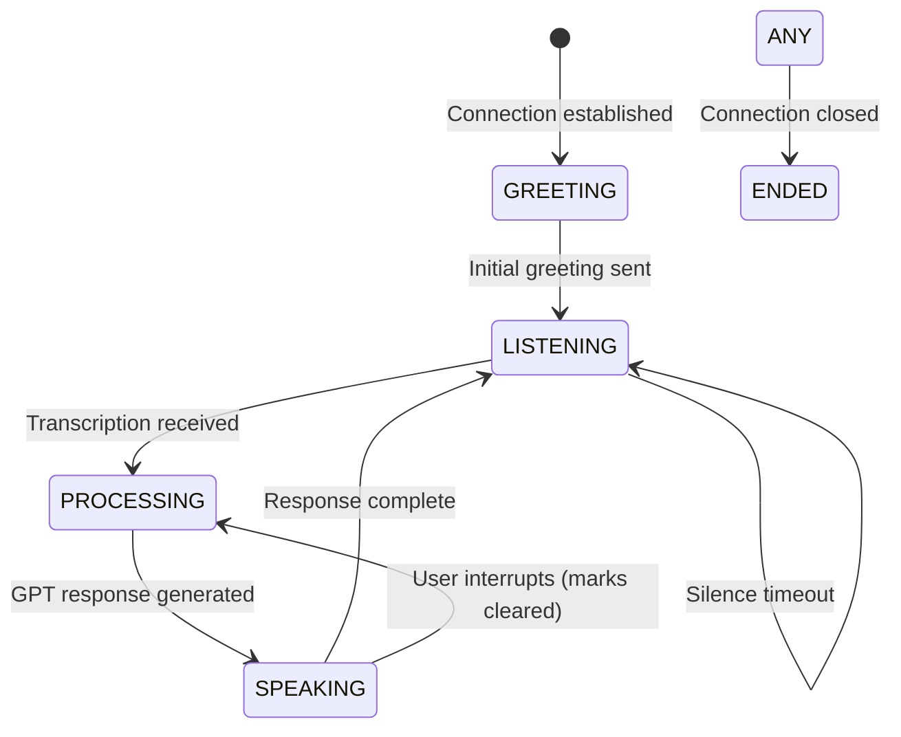

# CLAUDE.md - LLM Development Guide

This file provides comprehensive technical guidance for LLMs working on this compassionate AI companion system.

## System Purpose & Design Philosophy

**Mission**: Provide compassionate AI companionship for elderly individuals with dementia and anxiety when family members cannot be immediately available.

**Core Design Principles**:
- **Patience Over Efficiency**: Never rush or show frustration with repetition
- **Validation Over Correction**: Acknowledge feelings rather than correcting confusion  
- **Comfort Over Accuracy**: Prioritize emotional well-being over factual precision
- **Familiarity Over Novelty**: Use familiar topics and gentle redirection
- **Safety Over Features**: All features must consider the user's vulnerable state

**Critical Context for Development**:
- Users have severe dementia and will not remember previous conversations
- Users experience high anxiety and need constant reassurance
- The AI may be their only available companion during distressing moments
- Every interaction must prioritize dignity and emotional comfort
- Technical optimizations must never compromise compassionate responses

## Communication Flows

### Production Flow (Phone Calls via Twilio)
```
Entry Point: POST /incoming
Flow: Twilio → WebSocket /connection → Audio Pipeline
Pipeline: Twilio Media Stream → Deepgram STT → OpenAI GPT → Deepgram TTS → Twilio
Key Features: Real-time streaming, interruption handling, mark-based audio tracking
```

### Development Flow (Text Chat) 
```
Entry Point: npm run chat → scripts/text-chat.js → services/chat-session.js
Flow: Console Input → Mock Services → GPT → Console Output
Pipeline: Text → Mock STT → OpenAI GPT → Mock TTS → Formatted Console
Key Features: Mirrors production flow, usage tracking, debug mode, memory inspection
```

## Event-Driven Service Architecture

| Event | Payload Schema | Emitted By | Consumed By | Purpose |
|-------|----------------|------------|-------------|---------|
| `message` | `{event: 'start/media/mark/stop', ...data}` | Twilio WebSocket | app.js | Raw WebSocket messages from Twilio |
| `utterance` | `text: string` | TranscriptionService | app.js | User interruption detected |
| `transcription` | `text: string` | TranscriptionService | GptService | Final user speech transcribed |
| `gptreply` | `{partialResponse: string, partialResponseIndex: number, isFinal: boolean}` | GptService | TtsService | AI response chunk ready |
| `speech` | `(responseIndex, audio, label, icount)` | TtsService | StreamService | TTS audio ready for streaming |
| `audiosent` | `markLabel: string` | StreamService | app.js | Audio chunk sent with mark |
| `responseComplete` | none | ChatSession | readline prompt | Chat response fully displayed |
| `sessionEnded` | none | ChatSession | text-chat.js | Chat session terminated |

## Conversation State Machine



**State Behaviors**:
- **GREETING**: Send random warm greeting immediately
- **LISTENING**: Buffer audio, detect utterances
- **PROCESSING**: Generate GPT response, handle functions
- **SPEAKING**: Stream TTS audio, track marks
- **ENDED**: Save conversation, cleanup services

## Memory & Persistence Architecture

### Database Structure (SQLite)
```sql
conversations: id, call_sid, start_time, end_time, duration, summary_text
messages: id, conversation_id, role, content, timestamp
memories: id, key, content, category, created_at, updated_at, last_accessed
```

### Memory Service Operations
- **Initialize**: Load all memory keys at startup
- **Store**: Silent operation, categorized storage
- **Recall**: Pattern matching on keys
- **Update**: Progressive information building
- **Forget**: Remove outdated information

### Conversation Analyzer Tracking
- User utterances with timestamps
- Assistant responses with timestamps
- Interruption events
- Mental state indicators (anxiety, agitation, confusion)
- Care indicators (medication, pain, staff complaints)

## Critical Implementation Patterns

### Response Chunking Pattern
```javascript
// MANDATORY: Use bullet points (•) for response chunking
"Hello Francine! • How are you doing today? • It's so nice to hear from you."
// Each bullet creates a separate TTS request for faster initial response
```

### Interruption Handling Pattern
```javascript
// 1. Detect interruption via utterance event
if(marks.length > 0 && text?.length > 5) {
  // 2. Clear Twilio stream
  ws.send(JSON.stringify({streamSid, event: 'clear'}));
  // 3. Clear transcription buffers
  transcriptionService.clearBuffers();
  // 4. Track in analyzer
  conversationAnalyzer.trackInterruption(new Date());
}
```

### Context Management Pattern
```javascript
// System context structure
userContext = [
  {role: 'system', content: systemPrompt}, // With memory keys
  {role: 'assistant', content: greeting},
  {role: 'system', content: `callSid: ${callSid}`},
  // Conversation history follows...
]
```

### Template Service Pattern
```javascript
// Templates in templates/ directory
// Loaded via TemplateService with Mustache rendering
// Memory keys injected into system prompt template
```

## Function Calling Guidelines

### Emergency Assessment (transferCallDeferred)
```
CRITICAL: Francine often exaggerates due to anxiety
Assessment Required:
- Actual medical distress (chest pain, inability to breathe)
- Physical injury (fall with pain)
- Genuine emergency situations
Default: Redirect and comfort instead of transfer
```

### Primary Engagement Tool (getNewsHeadlines)
```
Usage: PROACTIVE when conversation becomes circular
Purpose: Novel topics reduce anxiety through distraction
Categories: General, health, science, entertainment
Timing: Use early and often for redirection
```

### Memory Operations (SILENT - Never Announce)
```
rememberInformation: Store new facts naturally
recallMemory: Retrieve for context
updateMemory: Build progressive understanding
forgetMemory: Remove incorrect information
listAvailableMemories: Discovery operation
CRITICAL: Never tell user about memory operations
```

### Call Management
```
endCallDeferred: Graceful conversation ending
Say goodbye naturally before triggering
```

## Error Recovery Patterns

| Error Type | Recovery Strategy | Implementation | User Experience |
|------------|------------------|----------------|-----------------|
| GPT API Timeout | Fallback message | 10-second timeout, pre-recorded comfort | "I'm having trouble thinking, could you repeat that?" |
| Deepgram STT Failure | Continue listening | Log error, wait for recovery | Silent continuation |
| Deepgram TTS Failure | Skip response | Log error, continue conversation | Brief pause in responses |
| Database Write Failure | Continue without persistence | Queue retry, prioritize live conversation | No impact on conversation |
| WebSocket Disconnect | Log and cleanup | Save partial conversation, close services | Call ends gracefully |
| Memory Service Failure | Continue without memory | Log error, operate stateless | Reduced personalization |
| Function Execution Error | Continue conversation | Log error, respond naturally | Natural flow maintained |

## Environment Configuration

| Variable | Required | Default | Description |
|----------|----------|---------|-------------|
| `SERVER` | Yes | - | Server domain without https:// |
| `OPENAI_API_KEY` | Yes | - | OpenAI API key for GPT |
| `DEEPGRAM_API_KEY` | Yes | - | Deepgram API key for STT/TTS |
| `VOICE_MODEL` | No | aura-asteria-en | Deepgram voice model |
| `RECORDING_ENABLED` | No | false | Enable call recording |
| `SQLITE_DB_PATH` | No | ./storage/conversation-summaries.db | Database location (relative to project root) |
| `TIMEZONE` | No | America/Los_Angeles | IANA timezone for admin dashboard display |
| `PORT` | No | 3000 | Server port |
| `TWILIO_ACCOUNT_SID` | For testing | - | Twilio account SID |
| `TWILIO_AUTH_TOKEN` | For testing | - | Twilio auth token |
| `FROM_NUMBER` | For testing | - | Twilio phone number |
| `APP_NUMBER` | For testing | - | Application phone number |
| `YOUR_NUMBER` | For testing | - | Your phone for testing |

## Testing & Development Workflows

### Text Chat Testing (Primary Development Tool)
```bash
npm run chat
# Interactive console with:
# - Real GPT integration
# - Mock audio services  
# - Memory persistence
# - Usage tracking
# Commands: /help, /stats, /context, /memories, /debug, /reset, /exit
```

### Phone Call Testing
```bash
npm run inbound  # Automated test script
npm run outbound # Calls YOUR_NUMBER
```

### Development Mode
```bash
npm run dev # Nodemon auto-reload
```

### Unit Testing
```bash
npm test # Jest tests for functions
```

## File Organization & Dependencies

### Core Application Layer
```
app.js                    # Express server, WebSocket handler, service orchestration
├── Initializes all services
├── Handles Twilio WebSocket
├── Manages conversation lifecycle
└── Saves summaries on close
```

### Service Layer (services/)
```
gpt-service.js           # OpenAI integration, function calling, context management
├── Manages userContext array
├── Handles streaming responses
└── Executes function calls

transcription-service.js # Deepgram STT with utterance detection
├── Processes audio chunks
├── Detects speech endings
└── Emits transcriptions

tts-service.js          # Deepgram TTS with response chunking
├── Splits on bullet points
├── Generates audio chunks
└── Manages speech queue

stream-service.js       # Audio buffering and mark management
├── Buffers audio chunks
├── Sends to Twilio
└── Tracks marks

memory-service.js       # Persistent memory storage
├── SQLite backend
├── Category management
└── Pattern matching

conversation-analyzer.js # Mental state tracking
├── Tracks utterances
├── Analyzes patterns
└── Generates insights

chat-session.js         # Development chat interface
├── Mirrors production flow
├── Mock services
└── Console UI

template-service.js     # Mustache template rendering
├── Loads templates
├── Injects variables
└── Caches rendered
```

### Function Layer (functions/)
```
function-manifest.js    # GPT tool definitions
transferCallDeferred.js # Emergency escalation
getNewsHeadlines.js    # Engagement tool
rememberInformation.js # Store memory
recallMemory.js       # Retrieve memory
updateMemory.js       # Update memory
forgetMemory.js       # Delete memory
listAvailableMemories.js # List all memories
endCallDeferred.js    # End call gracefully
```

### Mock Services (for chat interface)
```
mock-transcription-service.js # Simulates STT
mock-tts-service.js          # Simulates TTS
mock-stream-service.js       # Simulates audio streaming
```

### Admin Interface (routes/)
```
admin.js              # Admin dashboard
api/admin-stats.js   # Statistics API
api/admin-config.js  # Configuration API
```

## Service Initialization Sequence

1. **Database Manager** → Ensures SQLite is ready
2. **Memory Service** → Loads stored memories
3. **GPT Service** → Initializes with memory keys
4. **Transcription Service** → Connects to Deepgram
5. **TTS Service** → Prepares audio generation
6. **Stream Service** → Sets up buffering
7. **Conversation Analyzer** → Begins tracking

## Critical Patterns for Modifications

### Adding New Functions
1. Create function file in `functions/` matching exact name
2. Add definition to `function-manifest.js`
3. Include `say` property for pre-execution speech
4. Return value to prevent repeated calls
5. Consider silent operation for background tasks

### Modifying GPT Behavior
1. System prompt in `template-service.js` and `templates/`
2. Bullet points (•) are MANDATORY for chunking
3. Context array in `gpt-service.js`
4. Memory keys injected at initialization

### Adding Service Events
1. Define event in architecture table above
2. Emit from service: `this.emit('eventName', data)`
3. Listen in consumer: `service.on('eventName', handler)`
4. Update conversation analyzer if tracking needed

### Database Schema Changes
1. Modify `database-manager.js` initialization
2. Add migration logic for existing data
3. Update storage service methods
4. Test with both new and existing databases

### Database Access Pattern (Singleton)
**CRITICAL**: DatabaseManager uses a singleton pattern to ensure consistent database access:

```javascript
// CORRECT - Use getInstance() for production code
const dbManager = DatabaseManager.getInstance();
await dbManager.waitForInitialization();

// TESTING ONLY - Direct instantiation allowed for test isolation
const testDb = new DatabaseManager('./test.db');
```

**Singleton Benefits**:
- **Consistent Path**: SQLITE_DB_PATH environment variable honored globally
- **Single Connection**: Prevents database lock conflicts
- **Shared Cache**: Better performance through connection pooling
- **Migration Safety**: Ensures migrations run only once

**Important Notes**:
- The singleton instance is created on first `getInstance()` call
- Path is determined by: `process.env.SQLITE_DB_PATH || './storage/conversation-summaries.db'`
- Relative paths are resolved to absolute paths from project root
- All services share the same database connection
- Test files may use direct instantiation for isolation
- Use `DatabaseManager.resetInstance()` only in test teardown
- Minimum conversation duration: 2 seconds (shorter calls are not saved)

## Performance Considerations

- **Response Time**: First TTS chunk should play within 2 seconds
- **Interruption**: Clear stream within 100ms of detection
- **Memory**: Keep context under 128k tokens
- **Database**: Async operations to prevent blocking
- **WebSocket**: Handle disconnections gracefully

## Security Considerations

- **No PHI/PII Logging**: Conversation summaries only
- **Environment Variables**: Never commit .env
- **Function Validation**: Sanitize all function arguments
- **Database**: Local SQLite, no external transmission
- **API Keys**: Rotate regularly, use environment vars

## Debugging Guide

### Common Issues

| Symptom | Likely Cause | Solution |
|---------|--------------|----------|
| No greeting on call | Recording service delay | Check RECORDING_ENABLED |
| Repeated function calls | Missing return value | Ensure functions return data |
| Slow responses | No bullet points | Add • to GPT responses |
| Lost context | Context overflow | Implement pruning strategy |
| No memory persistence | DB initialization failed | Check SQLITE_DB_PATH permissions |
| Interruptions not working | Mark tracking broken | Verify mark array management |

### Debug Commands (Chat Mode)
- `/debug` - Toggle verbose logging
- `/context` - Show GPT context
- `/memories` - Display all stored memories
- `/stats` - Show token usage
- `/storage` - Recent conversation summaries

## Development Best Practices

1. **Test in Chat First**: Use `npm run chat` before phone testing
2. **Monitor Token Usage**: Watch context size in chat stats
3. **Test Interruptions**: Speak while AI is responding
4. **Verify Memory**: Check persistence across sessions
5. **Test Error Cases**: Disconnect, timeout scenarios
6. **Maintain Compassion**: Every change must serve the user's emotional needs

## Critical Reminders

- **User Has Dementia**: They won't remember previous calls
- **Anxiety Is Constant**: Prioritize comfort over efficiency
- **Repetition Is Expected**: Never show frustration
- **Emergencies Are Rare**: Most "emergencies" are anxiety
- **Memory Is Silent**: Never mention storing/recalling
- **Testing Matters**: Use chat interface extensively
- **Compassion First**: Technical excellence serves emotional care