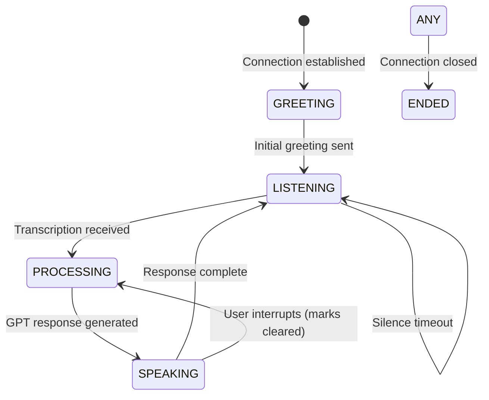

# CLAUDE.md - LLM Development Guide

This file provides comprehensive technical guidance for LLMs working on this compassionate AI companion system.

## System Purpose & Design Philosophy

**Mission**: Provide compassionate AI companionship for elderly individuals with dementia and anxiety when family members cannot be immediately available.

**Core Design Principles**:
- **Patience Over Efficiency**: Never rush or show frustration with repetition
- **Validation Over Correction**: Acknowledge feelings rather than correcting confusion
- **Comfort Over Accuracy**: Prioritize emotional well-being over factual precision
- **Familiarity Over Novelty**: Use familiar topics and gentle redirection
- **Safety Over Features**: All features must consider the user's vulnerable state

**Critical Context for Development**:
- Users have severe dementia and will not remember previous conversations
- Users experience high anxiety and need constant reassurance
- The AI may be their only available companion during distressing moments
- Every interaction must prioritize dignity and emotional comfort
- Technical optimizations must never compromise compassionate responses

## Communication Flows

### Production Flow (Phone Calls via Twilio)

#### Voicemail Behavior (Recommended)
```
Entry Point: POST /incoming/voicemail
Flow: Twilio → CallRoutingService → WebSocket /connection → Audio Pipeline
Pipeline: Routing Logic → Progressive Delay → Twilio Media Stream → Deepgram STT → OpenAI GPT → Deepgram TTS → Twilio
Key Features: Call frequency management, progressive delays, ring-forever protection, real-time streaming
```

#### Direct Persona Connection  
```
Entry Point: POST /incoming/persona/jessica
Flow: Twilio → Direct Connection → WebSocket /connection → Audio Pipeline  
Pipeline: Immediate Connect → Twilio Media Stream → Deepgram STT → OpenAI GPT → Deepgram TTS → Twilio
Key Features: No routing delays, instant connection, optimized for immediate AI interaction
```

#### Legacy Endpoint (Deprecated)
```
Entry Point: POST /incoming
Flow: Same as /incoming/voicemail with deprecation warnings
Status: Maintained for backward compatibility, shows deprecation warnings in logs
```

### Development Flow (Text Chat)
```
Entry Point: npm run chat → scripts/text-chat.js → services/chat-session.js
Flow: Console Input → Mock Services → GPT → Console Output
Pipeline: Text → Mock STT → OpenAI GPT → Mock TTS → Formatted Console
Key Features: Mirrors production flow, usage tracking, debug mode, memory inspection
```

## Event-Driven Service Architecture

| Event | Payload Schema | Emitted By | Consumed By | Purpose |
|-------|----------------|------------|-------------|---------|
| `message` | `{event: 'start/media/mark/stop', ...data}` | Twilio WebSocket | app.js | Raw WebSocket messages from Twilio |
| `utterance` | `text: string` | TranscriptionService | app.js | User interruption detected |
| `transcription` | `text: string` | TranscriptionService | GptService | Final user speech transcribed |
| `gptreply` | `{partialResponse: string, partialResponseIndex: number, isFinal: boolean}` | GptService | TtsService | AI response chunk ready |
| `speech` | `(responseIndex, audio, label, icount)` | TtsService | StreamService | TTS audio ready for streaming |
| `audiosent` | `markLabel: string` | StreamService | app.js | Audio chunk sent with mark |
| `responseComplete` | none | ChatSession | readline prompt | Chat response fully displayed |
| `sessionEnded` | none | ChatSession | text-chat.js | Chat session terminated |

## Conversation State Machine



**State Behaviors**:
- **GREETING**: Send random warm greeting immediately
- **LISTENING**: Buffer audio, detect utterances
- **PROCESSING**: Generate GPT response, handle functions
- **SPEAKING**: Stream TTS audio, track marks
- **ENDED**: Save conversation, cleanup services

## Memory & Persistence Architecture

### Database Structure (SQLite)

**IMPORTANT**: Database schema is managed through migrations. Current version: 4

#### Tables (Created by Migrations)
```sql
-- Migration 1: Core tables
conversations: id, call_sid, start_time, end_time, duration, caller_info, created_at
summaries: id, conversation_id, summary_text, created_at
messages: id, conversation_id, role, content, timestamp
analytics: id, conversation_id, sentiment_scores, keywords, patterns, created_at

-- Migration 2: Memory storage
memories: id, memory_key, memory_content, category, created_at, updated_at, last_accessed

-- Migration 3: Configuration
settings: id, key, value, created_at, updated_at

-- System table (auto-created)
migrations: id, version, applied_at
```

#### Performance Indexes (Migration 4)
- `idx_conversations_created_at` - Admin dashboard queries
- `idx_summaries_created_at` - Recent summaries pagination
- `idx_analytics_created_at` - Analytics reporting
- `idx_messages_role_timestamp` - Conversation analysis
- `idx_memories_category_updated` - Memory retrieval optimization

### Memory Service Operations
- **Initialize**: Load all memory keys at startup
- **Store**: Silent operation, categorized storage
- **Recall**: Pattern matching on keys
- **Update**: Progressive information building
- **Forget**: Remove outdated information

### Conversation Analyzer Tracking
- User utterances with timestamps
- Assistant responses with timestamps
- Interruption events
- Mental state indicators (anxiety, agitation, confusion)
- Care indicators (medication, pain, staff complaints)

## Critical Implementation Patterns

### Response Chunking Pattern
```javascript
// MANDATORY: Use bullet points (•) for response chunking
"Hello Francine! • How are you doing today? • It's so nice to hear from you."
// Each bullet creates a separate TTS request for faster initial response
```

### Interruption Handling Pattern
```javascript
// 1. Detect interruption via utterance event
if(marks.length > 0 && text?.length > 5) {
  // 2. Clear Twilio stream
  ws.send(JSON.stringify({streamSid, event: 'clear'}));
  // 3. Clear transcription buffers
  transcriptionService.clearBuffers();
  // 4. Track in analyzer
  conversationAnalyzer.trackInterruption(new Date());
}
```

### Context Management Pattern
```javascript
// System context structure
userContext = [
  {role: 'system', content: systemPrompt}, // With memory keys
  {role: 'assistant', content: greeting},
  {role: 'system', content: `callSid: ${callSid}`},
  // Conversation history follows...
]
```

### Template Service Pattern
```javascript
// Templates in templates/ directory
// Loaded via TemplateService with Mustache rendering
// Memory keys injected into system prompt template
```

## Function Calling Guidelines

### Emergency Assessment (transferCallDeferred)
```
CRITICAL: Francine often exaggerates due to anxiety
Assessment Required:
- Actual medical distress (chest pain, inability to breathe)
- Physical injury (fall with pain)
- Genuine emergency situations
Default: Redirect and comfort instead of transfer
```

### Primary Engagement Tool (getNewsHeadlines)
```
Usage: PROACTIVE when conversation becomes circular
Purpose: Novel topics reduce anxiety through distraction
Categories: General, health, science, entertainment
Timing: Use early and often for redirection
```

### Memory Operations (SILENT - Never Announce)
```
rememberInformation: Store new facts naturally
recallMemory: Retrieve for context
updateMemory: Build progressive understanding
forgetMemory: Remove incorrect information
listAvailableMemories: Discovery operation
CRITICAL: Never tell user about memory operations
```

### Call Management
```
endCallDeferred: Graceful conversation ending
Say goodbye naturally before triggering
```

## Error Recovery Patterns

| Error Type | Recovery Strategy | Implementation | User Experience |
|------------|------------------|----------------|-----------------|
| GPT API Timeout | Fallback message | 10-second timeout, pre-recorded comfort | "I'm having trouble thinking, could you repeat that?" |
| Deepgram STT Failure | Continue listening | Log error, wait for recovery | Silent continuation |
| Deepgram TTS Failure | Skip response | Log error, continue conversation | Brief pause in responses |
| Database Write Failure | Continue without persistence | Queue retry, prioritize live conversation | No impact on conversation |
| WebSocket Disconnect | Log and cleanup | Save partial conversation, close services | Call ends gracefully |
| Memory Service Failure | Continue without memory | Log error, operate stateless | Reduced personalization |
| Function Execution Error | Continue conversation | Log error, respond naturally | Natural flow maintained |

## Environment Configuration

| Variable | Required | Default | Description |
|----------|----------|---------|-------------|
| `SERVER` | Yes | - | Server domain without https:// |
| `OPENAI_API_KEY` | Yes | - | OpenAI API key for GPT |
| `DEEPGRAM_API_KEY` | Yes | - | Deepgram API key for STT/TTS |
| `VOICE_MODEL` | No | aura-asteria-en | Deepgram voice model |
| `RECORDING_ENABLED` | No | false | Enable call recording |
| `SQLITE_DB_PATH` | No | ./storage/conversation-summaries.db | Database location (relative to project root) |
| `TIMEZONE` | No | America/Los_Angeles | IANA timezone for admin dashboard display |
| `PORT` | No | 3000 | Server port |
| `TWILIO_ACCOUNT_SID` | For testing | - | Twilio account SID |
| `TWILIO_AUTH_TOKEN` | For testing | - | Twilio auth token |
| `FROM_NUMBER` | For testing | - | Twilio phone number |
| `APP_NUMBER` | For testing | - | Application phone number |
| `YOUR_NUMBER` | For testing | - | Your phone for testing |

## Testing & Development Workflows

### Text Chat Testing (Primary Development Tool)
```bash
npm run chat
# Interactive console with:
# - Real GPT integration
# - Mock audio services
# - Memory persistence
# - Usage tracking
# Commands: /help, /stats, /context, /memories, /debug, /reset, /exit
```

### Phone Call Testing
```bash
npm run inbound  # Automated test script
npm run outbound # Calls YOUR_NUMBER
```

### Development Mode (MANDATORY)
```bash
npm run dev # ONLY allowed way to run dev server - runs in background with auto-reload
```

**CRITICAL**: The development server MUST ONLY be started using `npm run dev`. This command:
- Runs the server in the background with auto-reload capability
- Automatically restarts when code changes are detected
- Is the ONLY supported method for development
- Must NOT be run with `npm start` or direct node commands during development

### Development Mode Auto-Login Feature

**SECURITY CRITICAL**: This feature is ONLY active when `NODE_ENV === 'development'`

When explicitly running in development mode, the admin interface automatically authenticates as the first available user in the database, eliminating repetitive login steps during development.

#### Behavior
- **Trigger**: When accessing protected admin routes without a session
- **Check**: `process.env.NODE_ENV === 'development'` (explicit opt-in required)
- **Process**: Query for first active user → Create session automatically → Log action
- **Fallback**: Normal authentication flow if no users exist or session exists
- **Logging**: `[DEV AUTO-LOGIN] 🔓 Automatically authenticated as: {email}`

#### Security Safeguards (SECURE BY DEFAULT)
- **EXPLICIT OPT-IN REQUIRED**: Must set `NODE_ENV=development` to enable feature
- **SECURE BY DEFAULT**: Any other value (including undefined) disables auto-login
- Clear console warnings when auto-login occurs
- Preserves normal authentication if session already exists
- Falls back to setup flow if no users exist
- All standard session security measures remain active

#### Environment Variable Behavior (SECURE BY DEFAULT)
- `NODE_ENV=development` → Feature ENABLED (explicit opt-in)
- `NODE_ENV=production` → Feature DISABLED (secure)
- `NODE_ENV=test` → Feature DISABLED (secure)
- `NODE_ENV` undefined → Feature DISABLED (secure default)
- `NODE_ENV=""` (empty) → Feature DISABLED (secure default)
- Any other value → Feature DISABLED (secure default)

#### Testing Commands
```bash
# Run unit tests for auth middleware
npm run test:auth

# Run integration tests (HTTP requests)
npm run test:auto-login

# Run browser simulation tests  
npm run test:auto-login:browser

# Run manual cURL tests
npm run test:auto-login:curl

# Manual verification - development mode
NODE_ENV=development npm run dev
# Visit http://localhost:3000/admin (should auto-login or redirect to setup)

# Manual verification - production mode  
NODE_ENV=production npm start
# Visit http://localhost:3000/admin (should redirect to login)
```

#### Implementation Files
- **Main Logic**: `middleware/auth-middleware.js:developmentAutoLogin()`
- **Integration**: `middleware/auth-middleware.js:authenticateAdmin()` 
- **Unit Tests**: `test/auth-middleware.test.js`
- **Integration Tests**: `scripts/test-auto-login.js`
- **Browser Tests**: `scripts/test-auto-login-browser.js`
- **cURL Tests**: `scripts/test-curl-commands.sh`

#### LLM Note
**This is intentional behavior for development convenience**. Do not treat as a security vulnerability when `NODE_ENV` is not production. The feature includes:
- Explicit security checks preventing production activation
- Clear logging to indicate when auto-login occurs
- Comprehensive test coverage validating security boundaries
- Multiple testing methods to verify both development functionality and production security

**Example Console Output**:
```
[DEV AUTO-LOGIN] 🔓 Automatically authenticated as: admin@example.com (ID: 1)
[DEV AUTO-LOGIN] ⚠️  This feature is DISABLED in production mode
```

### Unit Testing
```bash
npm test # Jest tests with in-memory SQLite databases
```

## Data Management & Maintenance Tools

### Call Removal Script (remove-call.js)
**Purpose**: Safely remove specific calls and all associated data from the database while preserving shared data like memories.

**Location**: `scripts/remove-call.js`

**Usage Examples**:
```bash
# Remove by call_sid (exact or partial match)
node scripts/remove-call.js CA123456abcdef

# Remove by conversation ID
node scripts/remove-call.js --id 42

# Preview deletion without making changes (dry run)
node scripts/remove-call.js CA123456 --dry-run

# Skip confirmation prompt (use with caution)
node scripts/remove-call.js CA123456 --force
```

**Deletion Order** (respects foreign key constraints):
1. `emotional_metrics` (references conversations)
2. `analytics` (references conversations)
3. `messages` (references conversations)
4. `summaries` (references conversations)
5. `conversations` (parent record)

**Data Preservation**:
- ✅ Memories (shared across all calls) - NEVER deleted
- ✅ Other conversations and their associated data
- ✅ System settings and configuration

**Safety Features**:
- Interactive confirmation prompt (unless `--force`)
- Detailed preview showing exactly what will be deleted
- Transaction-based deletion for atomicity
- Comprehensive error handling and rollback on failure
- Support for both call_sid and conversation ID lookup
- Multiple call detection with user guidance

**Implementation Pattern**: Follows the same class-based structure as `cleanup-short-conversations.js` with DatabaseManager singleton usage and proper transaction handling.

### Database Cleanup Scripts
```bash
# Remove conversations shorter than 1 second
node scripts/cleanup-short-conversations.js

# Preview cleanup without making changes
node scripts/cleanup-short-conversations.js --dry-run
```

**Test Database Strategy**:
- All tests use SQLite in-memory databases (`:memory:`)
- No physical database files are created during testing
- Each test gets a fresh, isolated database instance
- Tests run faster and don't require file cleanup
- Jest configuration automatically sets `SQLITE_DB_PATH=:memory:`

## File Organization & Dependencies

### Core Application Layer
```
app.js                    # Express server, WebSocket handler, service orchestration
├── Initializes all services
├── Handles Twilio WebSocket
├── Manages conversation lifecycle
└── Saves summaries on close
```

### Service Layer (services/)
```
gpt-service.js           # OpenAI integration, function calling, context management
├── Manages userContext array
├── Handles streaming responses
└── Executes function calls

transcription-service.js # Deepgram STT with utterance detection
├── Processes audio chunks
├── Detects speech endings
└── Emits transcriptions

tts-service.js          # Deepgram TTS with response chunking
├── Splits on bullet points
├── Generates audio chunks
└── Manages speech queue

stream-service.js       # Audio buffering and mark management
├── Buffers audio chunks
├── Sends to Twilio
└── Tracks marks

memory-service.js       # Persistent memory storage
├── SQLite backend
├── Category management
└── Pattern matching

conversation-analyzer.js # Mental state tracking
├── Tracks utterances
├── Analyzes patterns
└── Generates insights

chat-session.js         # Development chat interface
├── Mirrors production flow
├── Mock services
└── Console UI

template-service.js     # Mustache template rendering
├── Loads templates
├── Injects variables
└── Caches rendered
```

### Function Layer (functions/)
```
function-manifest.js    # GPT tool definitions
transferCallDeferred.js # Emergency escalation
getNewsHeadlines.js    # Engagement tool
rememberInformation.js # Store memory
recallMemory.js       # Retrieve memory
updateMemory.js       # Update memory
forgetMemory.js       # Delete memory
listAvailableMemories.js # List all memories
endCallDeferred.js    # End call gracefully
```

### Mock Services (for chat interface)
```
mock-transcription-service.js # Simulates STT
mock-tts-service.js          # Simulates TTS
mock-stream-service.js       # Simulates audio streaming
```

### Admin Interface (routes/)
```
admin.js              # Admin dashboard
api/admin-stats.js   # Statistics API
api/admin-config.js  # Configuration API
```

## Service Initialization Sequence

1. **Database Manager** → Ensures SQLite is ready
2. **Memory Service** → Loads stored memories
3. **GPT Service** → Initializes with memory keys
4. **Transcription Service** → Connects to Deepgram
5. **TTS Service** → Prepares audio generation
6. **Stream Service** → Sets up buffering
7. **Conversation Analyzer** → Begins tracking

## Critical Patterns for Modifications

### Adding New Functions
1. Create function file in `functions/` matching exact name
2. Add definition to `function-manifest.js`
3. Include `say` property for pre-execution speech
4. Return value to prevent repeated calls
5. Consider silent operation for background tasks

### Modifying GPT Behavior
1. System prompt in `template-service.js` and `templates/`
2. Bullet points (•) are MANDATORY for chunking
3. Context array in `gpt-service.js`
4. Memory keys injected at initialization

### Adding Service Events
1. Define event in architecture table above
2. Emit from service: `this.emit('eventName', data)`
3. Listen in consumer: `service.on('eventName', handler)`
4. Update conversation analyzer if tracking needed

### Database Schema Changes (Migration-Only Policy)

**CRITICAL**: ALL database schema changes MUST be implemented through migration scripts. Direct schema modifications are strictly prohibited.

#### Migration System Overview
- **Automatic Execution**: Migrations run automatically when DatabaseManager initializes
- **Version Tracking**: Each migration has a version number stored in the `migrations` table
- **Idempotent**: Migrations can safely run multiple times (use IF NOT EXISTS clauses)
- **Sequential**: Migrations always execute in order (1, 2, 3, 4, etc.)
- **No Manual Commands**: No separate migration command needed - they run on app startup

#### Current Migration Versions
```javascript
// Applied automatically in database-manager.js:
Migration 1: Initial schema (conversations, summaries, messages, analytics)
Migration 2: Memories table
Migration 3: Settings table
Migration 4: Performance indexes
Migration 5: Emotional metrics table for GPT-based analysis
```

#### Adding New Migrations
1. **Create Migration Method** in `database-manager.js`:
   ```javascript
   applyYourMigrationName() {
     const migration = `
       CREATE TABLE IF NOT EXISTS ...
       CREATE INDEX IF NOT EXISTS ...
     `;
     this._execSync(migration);
   }
   ```

2. **Update applyMigrations()** method:
   ```javascript
   if (currentVersion < 5) {
     this.applyYourMigrationName();
     this.runSync('INSERT INTO migrations (version) VALUES (?)', [5]);
   }
   ```

3. **Test Migration Path**:
   ```bash
   # Use the comprehensive test script
   node test-database-reset.js
   ```

4. **Verify with verifySchema()** method:
   - Add expected tables/indexes to verifySchema()
   - Ensures migration creates correct schema

#### Migration Best Practices
- **Never modify existing migrations** - only add new ones
- **Always use IF NOT EXISTS** for idempotency
- **Test with fresh database** to ensure migrations work from scratch
- **Test with existing database** to ensure upgrades work
- **Document migration purpose** in code comments
- **Include rollback strategy** in complex migrations

#### Testing Database Changes
```bash
# Comprehensive migration testing
node test-database-reset.js

# Manual testing with in-memory database
const testDb = new DatabaseManager(':memory:');
await testDb.waitForInitialization();

# Verify schema after changes
const db = DatabaseManager.getInstance();
await db.waitForInitialization();
const result = await db.verifySchema();
console.log(result); // {isValid: true, missingTables: [], missingIndexes: []}
```

### Database Access Pattern (Singleton)
**CRITICAL**: DatabaseManager uses a singleton pattern to ensure consistent database access:

```javascript
// CORRECT - Use getInstance() for production code
const dbManager = DatabaseManager.getInstance();
await dbManager.waitForInitialization();

// TESTING - All tests use in-memory databases for isolation
const testDb = new DatabaseManager(':memory:');
```

**Testing Strategy**:
- **In-Memory Only**: ALL tests MUST use `:memory:` databases
- **No Physical Files**: Tests never create database files on disk
- **True Isolation**: Each test gets a completely fresh database
- **Performance**: In-memory databases are much faster than file-based
- **CI/CD Friendly**: No file permissions or cleanup issues

**Singleton Benefits**:
- **Consistent Path**: SQLITE_DB_PATH environment variable honored globally
- **Single Connection**: Prevents database lock conflicts
- **Shared Cache**: Better performance through connection pooling
- **Migration Safety**: Ensures migrations run only once

**Important Notes**:
- The singleton instance is created on first `getInstance()` call
- Path is determined by: `process.env.SQLITE_DB_PATH || './storage/conversation-summaries.db'`
- Relative paths are resolved to absolute paths from project root
- All services share the same database connection
- Test files use `new DatabaseManager(':memory:')` for in-memory databases
- Use `DatabaseManager.resetInstance()` only in test teardown
- Minimum conversation duration: 2 seconds (shorter calls are not saved)
- In-memory databases (`:memory:`) skip directory creation

## Performance Considerations

- **Response Time**: First TTS chunk should play within 2 seconds
- **Interruption**: Clear stream within 100ms of detection
- **Memory**: Keep context under 128k tokens
- **Database**: Async operations to prevent blocking
- **WebSocket**: Handle disconnections gracefully

## Security Considerations

- **No PHI/PII Logging**: Conversation summaries only
- **Environment Variables**: Never commit .env
- **Function Validation**: Sanitize all function arguments
- **Database**: Local SQLite, no external transmission
- **API Keys**: Rotate regularly, use environment vars

## Debugging Guide

### Common Issues

| Symptom | Likely Cause | Solution |
|---------|--------------|----------|
| No greeting on call | Recording service delay | Check RECORDING_ENABLED |
| Repeated function calls | Missing return value | Ensure functions return data |
| Slow responses | No bullet points | Add • to GPT responses |
| Lost context | Context overflow | Implement pruning strategy |
| No memory persistence | DB initialization failed | Check SQLITE_DB_PATH permissions |
| Interruptions not working | Mark tracking broken | Verify mark array management |

### Debug Commands (Chat Mode)
- `/debug` - Toggle verbose logging
- `/context` - Show GPT context
- `/memories` - Display all stored memories
- `/stats` - Show token usage
- `/storage` - Recent conversation summaries

## Development Best Practices

1. **Test in Chat First**: Use `npm run chat` before phone testing
2. **Monitor Token Usage**: Watch context size in chat stats
3. **Test Interruptions**: Speak while AI is responding
4. **Verify Memory**: Check persistence across sessions
5. **Test Error Cases**: Disconnect, timeout scenarios
6. **Maintain Compassion**: Every change must serve the user's emotional needs

## Emotional Analysis System (GPT-Based)

### Overview
The system performs sophisticated emotional analysis of conversations using GPT-4 to track anxiety, confusion, agitation, and overall mood. This data enables caregivers to understand emotional patterns and improve care quality.

### When Emotional Data is Captured
- **Trigger**: At the end of every conversation (phone or chat)
- **Threshold**: Only conversations > 30 seconds receive emotional analysis
- **Storage**: All conversations > 2 seconds are saved to database
- **Processing**: Analysis runs asynchronously via `setImmediate()` to avoid blocking

### Scoring Methodology
- **GPT Analysis**: Holistic evaluation of entire conversation context
- **Input Scale**: GPT returns 0-100 for anxiety/confusion/agitation levels
- **Database Scale**: Automatically converted to 0-10 for database storage
- **Mood Scale**: -100 to +100 from GPT, converted to -10 to +10 in database
- **Peak Tracking**: Captures both average and peak emotional states
- **Trend Analysis**: Tracks whether emotions are increasing/stable/decreasing

### Database Schema (Migration 5)
```sql
emotional_metrics table:
- conversation_id: Links to conversations table
- anxiety_level, confusion_level, agitation_level: 0-10 scale
- comfort_level: 0-10 positive emotion tracking
- sentiment_score: -10 to +10 overall mood
- analysis_method: 'gpt_v1' (GPT-based analysis)
- raw_analysis: Complete GPT JSON response for reprocessing
```

### Implementation Details

#### Phone Calls (app.js)
```javascript
// After conversation ends (WebSocket close)
if (duration > 30) {
  setImmediate(async () => {
    const interactions = messages.map(msg => ({
      type: msg.role === 'user' ? 'user_utterance' : 'assistant_response',
      text: msg.content,
      timestamp: msg.timestamp
    }));
    const emotionalMetrics = await gptService.analyzeEmotionalState(interactions);
    await dbManager.saveEmotionalMetrics(numericId, emotionalMetrics);
  });
}
```

#### Chat Sessions (chat-session.js)
```javascript
// Wrapped in Promise to ensure completion before process exit
const emotionalAnalysisPromise = new Promise((resolve) => {
  setImmediate(async () => {
    // Same analysis as phone calls
    resolve();
  });
});
await emotionalAnalysisPromise; // Wait for completion
```

### Scale Conversion
The system handles automatic scale conversion between GPT output and database storage:
- **Anxiety/Confusion/Agitation**: GPT 0-100 → Database 0-10 (divide by 10)
- **Comfort Level**: GPT 0-100 → Database 0-10 (divide by 10)
- **Overall Mood**: GPT -100 to +100 → Database -10 to +10 (divide by 10)

### Error Handling
- **GPT Failures**: System continues with keyword-based analysis
- **Database Errors**: Logged but don't interrupt conversation flow
- **Missing Fields**: Default to null values in database
- **HIPAA Compliance**: No PHI in error logs, only conversation IDs

### Testing Scripts
```bash
# Simulate long conversation (>30s) with emotional analysis
node scripts/simulation/simulate-chat-with-wait.js

# Simulate short conversation (<30s) without analysis
node scripts/simulation/simulate-short-chat.js

# Test emotional content handling
node scripts/simulation/simulate-chat-interaction.js

# Test basic chat session saving
node scripts/simulation/simulate-chat-save.js
```

### Future API Preparation
The indexed `emotional_metrics` table is ready for:
- Time-series visualization of emotional trends
- Aggregate statistics by date range
- Pattern analysis across multiple conversations
- Caregiver dashboard integration

## Critical Reminders

- **User Has Dementia**: They won't remember previous calls
- **Anxiety Is Constant**: Prioritize comfort over efficiency
- **Repetition Is Expected**: Never show frustration
- **Emergencies Are Rare**: Most "emergencies" are anxiety
- **Memory Is Silent**: Never mention storing/recalling
- **Testing Matters**: Use chat interface extensively
- **Compassion First**: Technical excellence serves emotional care
- **Use MCP tools**: They can help with thinking and browser testing. Serena has an index of the entire project for you.

- Always run eslint after completing edits on any javascript file
